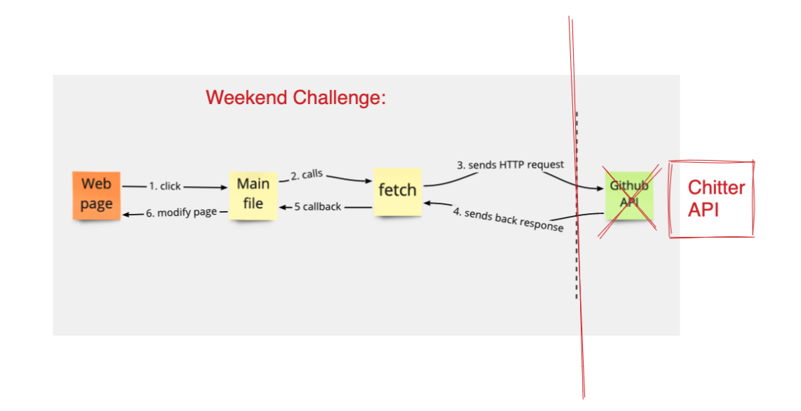
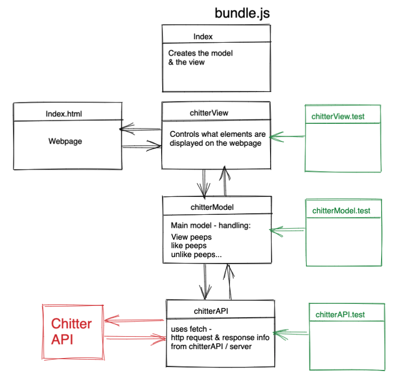

# Chitter API Frontend Challenge

## My Process

* Aim to use a TDD approach to completing the project, as set out below:
   - Plan
   - Test
   - Implement
   - Refactor
   - Commit
   
* Fork Repo
* Setup Jest within project directory
* Install ESLint within project directory
* Install ESBuild

* Try to understand what I need to do...

* Start with idea for domain model and mock-up of MVP(for weekend)

* Set up core file structure: index.js & index.html

Brief:
-------

* Feel free to use Google, your notes, books, etc. but work on your own
* If you refer to the solution of another coach or student, please put a link to that in your README
* If you have a partial solution, **still check in a partial solution**
* You must submit a pull request to this repo with your code by 9am Monday morning

Challenge:
-------

As usual please start by forking this repo.

We are going to write a small Twitter clone that will allow the users to post messages to a public stream.

The scenario is similar to the [Chitter Challenge](https://github.com/makersacademy/chitter-challenge), except someone has already built a backend API for you and hosted it on Heroku.

Your task is to build a front-end single-page-app to interface with this API. You can do this in any framework you like, or in pure Javascript. [The API documentation is here.](https://github.com/makersacademy/chitter_api_backend)

Here are some interactions the API supports. Implement as many as you see fit.

* Creating Users
* Logging in
* Posting Peeps
* Viewing all Peeps *(I suggest you start here)*
* Viewing individual Peeps
* Deleting Peeps
* Liking Peeps
* Unliking Peeps

We are looking for well tested, easy to read, easy to change code. This is more important than the number of interactions you implement.

Note that others may be doing the same task at the same time, so the data may change as you are using it.

## Utilities you might find useful

* [The Fetch API](https://developer.mozilla.org/en-US/docs/Web/API/Fetch_API/Using_Fetch) for making requests.
* [Postman](https://www.getpostman.com/) or [Insomnia](https://insomnia.rest/) for exploring the API.
